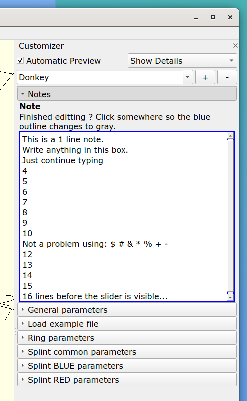
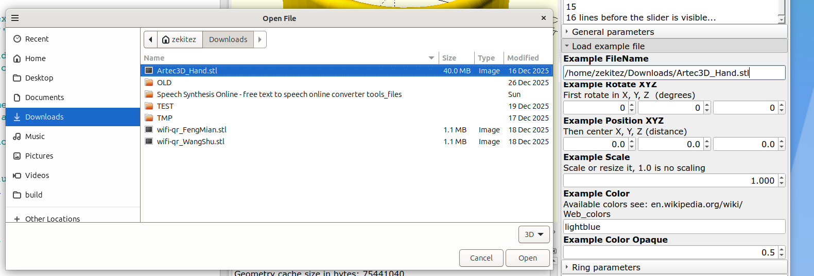
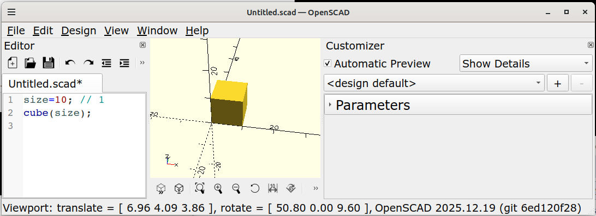
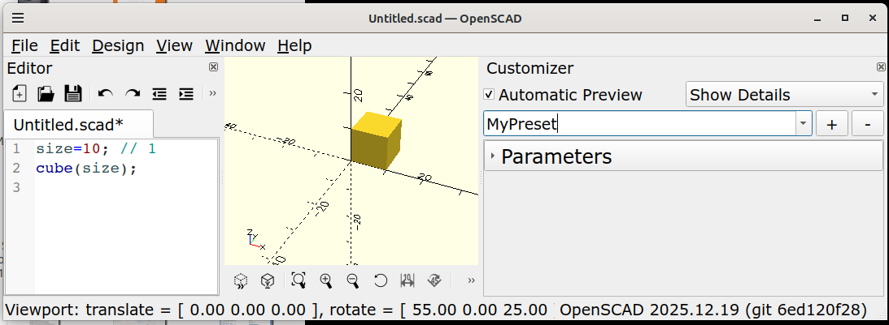
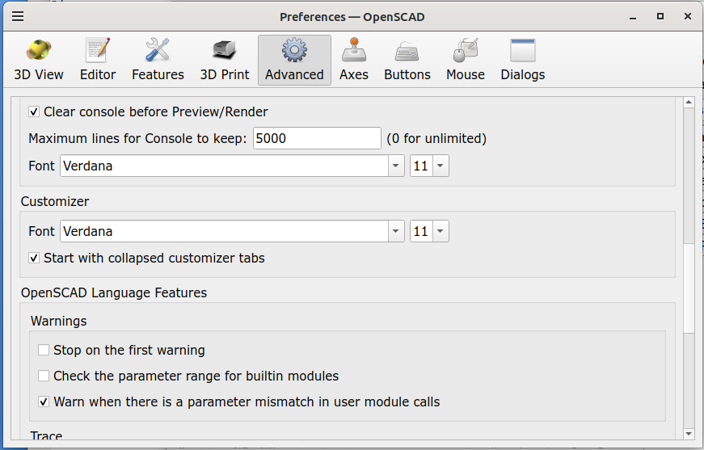
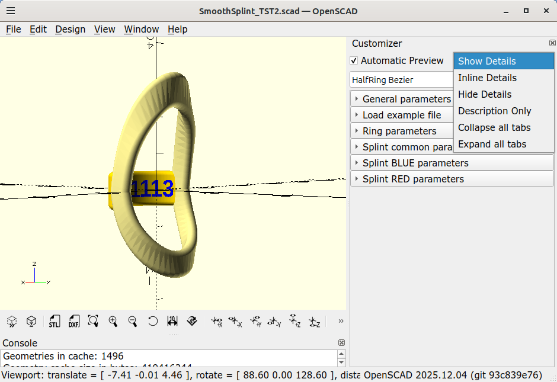

# OpenSCAD
This is where I keep my improvements to [openscad/openscad](https://github.com/openscad/openscad/)

Building notes for OpenSCAD, with the improvements, are kept in HowToBuild_OpenSCAD.txt .
Building notes for PythonSCAD, with the improvements, are kept in HowToBuild_PythonSCAD.txt .

NOTEs: 
1. The improvements described here are probably not avaiable in the official cersions OpenSCAD or PythonSCAD.
    Either download an unofficial version from "Releases" or compile your own versions using the building notes.
2. When cross compiling for windows a ~/openscad_deps directory is created by OpenSCAD but also by PythonSCAD.
    They differ and do NOT mix !!!

## 5 Added options, for a multiple line text box and an Open FileDialog, to the one line Text box for a string.
OpenSCAD just allows a one line text box. It is possible to give it a maximum size in number of characters. This number can be used as a trigger for different behavior for a multiple line text box or an open file dialog. This is now added with the following code:
```
//  1024 means use a multiple line text edit instead of the single line edit.
Note = "This...";         // 1024

//  1025 triggers an Open File dialog when the text is removed.
Example_FileName = "-";   // 1025
```





## 4 The font size and font family of the preset selection changes when the preset selection becomes editable. #6457 https://github.com/openscad/openscad/issues/6457
Only the "\<design default\>" of the preset selection, when selected, uses the font size and family as set for the "User Interface" via Menu Edit -> Preferences -> Tab Advanced -> User Interface.
Any added preset, when selected, uses a different font family and size. Is this intentionally behavior ? I assume not. Whenever comboBoxPreset is set editable a new QLineEdit is created but that QLineEdit does not use the "User Interface" font size and family because it is not set for the new QLineEdit.
It has to be set just after the comboBoxPreset is set editable in procedure ParameterWidget::updateSetEditability() in file src/gui/parameter/ParameterWidget.cc .







## 3 Feature request: Collapse and expand tabs as combo box function and startup preference #6434  https://github.com/openscad/openscad/issues/6434
I have scad file that builds a finger or thumb splint and has a lot of model parameters to tweak it into your personal finger/thumb shape, see https://www.thingiverse.com/thing:7145288 . The many parameters are divided into tabs. When a scad file is loaded all tabs are expanded on the initial preview and that scares off any user of the scad file when they see the many parameters. Opening all tabs collapsed removes the scarry part and gives a more easier access to the parameters. Its much more easier if you can collapse all tabs anf then just expand the tab where you want to change a parameter.
For me a user is somebody who uses the customizer and doesnot want to see or alter the scad code.
I noticed that this is not the first time a collapse/expand tabs request is made. To see the suggested change in action see the youtube video with a Windows version: https://www.youtube.com/watch?v=t_vN4xlLtOo .

Suggested change:
- after loading the scad file all tabs are collapsed or expanded selected via a preference option.
- add a "Collapse all tabs" and "Expand all tabs" entry to the combobox "Show Details" of the customizer.
- maintain the current behavior of expanding and collapsing tabs in the customizer.
- any newly added tab to the scad file is expanded when previewed.

The changed locale language files and changed code files are available in this repository.

Alternatives:
- Keeping the current unfriendly behavior. Not really...
- Providing users with a version of OpenSCAD (Windows and Linux) which includes the suggested change.

Screenshots:





## 2 Building an installer for linux-gnu fails #6424 https://github.com/openscad/openscad/issues/6424
Describe the bug:

I am trying to build an installer for Linux but scripts/release-common.sh fails/stops.
First it does not build an AppImage. Instead it builds an openscad-*.x86-64.tar.gz but that stops on the strip command due to the dri and platforms directory. And then it stops at copying icons from the wrong directory. And it does not have the -DENABLE_PYTHON=ON option for the snapshot.

Fail at strip:

'/lib/x86_64-linux-gnu/libz.so.1' -> 'openscad-2025.12.05/lib/openscad/libz.so.1'
'/lib/x86_64-linux-gnu/libzstd.so.1' -> 'openscad-2025.12.05/lib/openscad/libzstd.so.1'
'/usr/lib/x86_64-linux-gnu/pulseaudio/libpulsecommon-16.1.so' -> 'openscad-2025.12.05/lib/openscad/libpulsecommon-16.1.so'
'/lib/x86_64-linux-gnu/qt5/plugins/platforms/libqxcb.so' -> 'openscad-2025.12.05/lib/openscad/platforms/libqxcb.so'
'/usr/lib/x86_64-linux-gnu/dri/swrast_dri.so' -> 'openscad-2025.12.05/lib/openscad/dri/swrast_dri.so'
strip: Warning: 'openscad-2025.12.05/lib/openscad/dri' is a directory
strip: Warning: 'openscad-2025.12.05/lib/openscad/platforms' is a directory

Fail at copy:

'/usr/lib/x86_64-linux-gnu/pulseaudio/libpulsecommon-16.1.so' -> 'openscad-2025.12.05/lib/openscad/libpulsecommon-16.1.so'
'/lib/x86_64-linux-gnu/qt5/plugins/platforms/libqxcb.so' -> 'openscad-2025.12.05/lib/openscad/platforms/libqxcb.so'
'/usr/lib/x86_64-linux-gnu/dri/swrast_dri.so' -> 'openscad-2025.12.05/lib/openscad/dri/swrast_dri.so'
cp: cannot stat 'icons/openscad.desktop': No such file or directory
cp: cannot stat 'icons/openscad.png': No such file or directory
cp: cannot stat 'icons/openscad.xml': No such file or directory

The solution for a openscad-*.x86-64.tar.gz is simple:

- move the strip command to the line just above "QTLIBDIR=$(dirname $(...."
- cp the icons from ./resources/icons instead from the not existing ./icons

## 1 Cross compiling with MXE from Linux (Ubuntu) for Windows fails #6421 https://github.com/openscad/openscad/issues/6421
Describe the bug:

Compiling for Linux (Ubuntu 24.04) following README went without problems.
But cross compiling with MXE from Linux for Windows fails due to a missing 'tbb'.
This is caused by missing the 'onetbb' package in scripts/mingw-x-build-dependencies.sh .
After onetbb is added to mingw-x-build-dependencies.sh and mingw-x-build-dependencies.sh is executed again restart the terminal session before "./scripts/release-common.sh mingw64" is called to prevent a found double tbb in path error.

To Reproduce:
Steps to reproduce the behavior:

- Start with a clean Linux installation, without all required packages.
- From the README do the 2 steps (code blocks) from "Getting the source code"
- From the README do the 2 steps from "Building for Linux/BSD"
- From the README do the 3 steps from "Building for Windows"
- Step 3 "./scripts/release-common.sh mingw64" will fail, see fail.log, with:
`
-- Checking for module "tbb"
-- Package tbb was not found in the pkg-config search path.
  
Perhaps you should add the directory containing "tbb.pc" to the PKG_CONFIG_PATH environment variable Package "tbb", required by "world", not found
CMake Error at /home/zekitez/openscad_deps/mxe/usr/x86_64-pc-linux-gnu/share/cmake-3.31/Modules/FindPkgConfig.cmake:645 (message):
The following required packages were not found:

. tbb

# PythonSCAD

## 1 Script create_appimage.sh fails on a missing pythonscad-python link, dependency libfive.so and an unknown linuxdeploy-plugin-python.sh. #227 https://github.com/pythonscad/pythonscad/issues/227
Descibe the bug:
The 1st issue is that "make install DESTDIR=../AppDir" fails on a missing pythonscad-python link.
After adding in the build directory "ln -s pythonscad pythonscad-python" the problem was solved.
See Fail_Log.txt line 839.

The 2nd issue is that linuxdeploy-plugin-python.sh is not in the pythonscad repository but in local
"/home/gsohler/git/linuxdeploy-plugin-python" and it is probably adapted for Python 3.12.3 . The problem was solved by cloning niess/linuxdeploy-plugin-python and patch it for Python 3.12.3 .

The 3rd issue is that "linuxdeploy --plugin qt --output appimage --appdir AppDir" fails on "ERROR: Could not find dependency: libfive.so". See Fail_Log.txt lines 866 and 1148. This was solved by removing "-DENABLE_LIBFIVE=1" from line 4 in file create_appimage.sh
"cmake -DCMAKE_INSTALL_PREFIX=/usr -DEXPERIMENTAL=1 -DENABLE_PYTHON=1 -DPYTHON_VERSION=3.12 -DENABLE_LIBFIVE=1 .."

I am confused... the created AppImage does not run Python from within the AppImage but uses a locally created Python venv. See attached screenshot.

20251215: The issue continues. Currently cross compiling for windows still fails and more undocumented packages are needed on Linux. See the issue.
